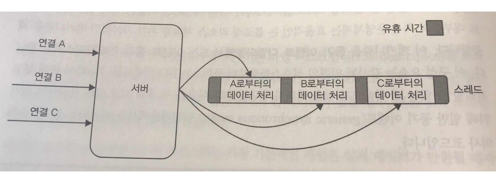
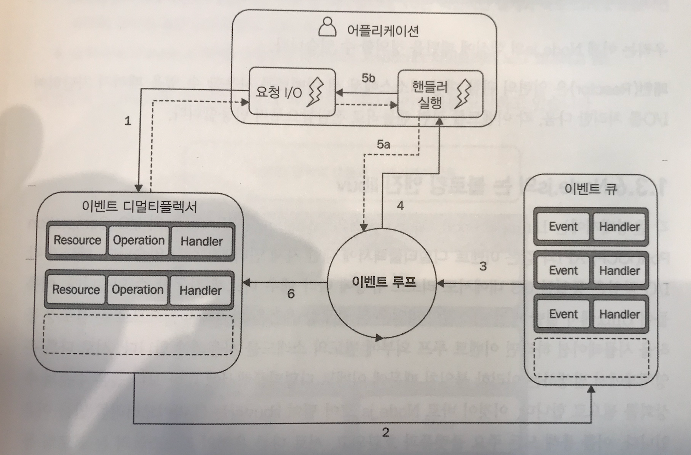

# Chapter1. Node.js 플랫폼에 오신 것을 환영합니다

## 작성 날짜: 2019.09.29

## 스터디 날짜: 2019.09.30

### 목차

- [Node.js 철학](#node.js-철학)
- [Node.js 6와 ES2015에 대한 소개](#node.js-6와-ES2015에-대한-소개)
- [Reactor 패턴](#reactor-패턴)

#### Node.js 철학

- 모든 플랫폼은 자신만의 철학을 가지고 있다. 이는 해당 플랫폼의 진화에 영향을 주는 역할을 하는 이데올로기, 어플리케이션 개발 및 설계에 대한 설명을 말한다
- `경량코어`
  - 핵심 기능 세트를 최소한으로 유지하면, 유지 보수 측면에서 편리할 뿐만 아니라 전체 생태계 발전에 긍정적인 영향을 가져올 수 있다
- `경량 모듈`
  - Node.js는 코드 크기 뿐만 아니라 범위적인 면에서도 작은 모듈을 설계 해야 한다
  - 이는 유닉스 철학에 뿌리를 두고 있다
    - 작은 것이 아름답다
    - 각 프로그램이 각기 한 가지 역할을 잘 하도록 만든다
  - NPM의 도움으로 각 패키지가 각기 고유한 별도의 일련의 의존성을 가지도록 하였다
  - Node의 방식은 어플리케이션을 작고 잘 집중화된 의존성들로 구성하여 재사용성을 극도로 높이는 것이다
  - 작은 모듈을 사용 함으로서 다음의 장점을 취할 수 있다
    - 이해하기 쉽고 사용하기 쉽다
    - 테스트 및 유지보수가 훨씬 간단하다
    - 브라우저와 완벽한 공유가 가능하다
  - 이는 DRY(가은 것을 반복하지 말라)원칙의 새로운 차원의 적용이다
- `작은 외부 인터페이스`
  - Node.js 모듈은 크기와 범위가 작을 뿐만 아니라 대개 최소한의 기능을 노출하는 특성을 가지고 있다
  - 이는 API 사용이 보다 명확해지고 잘못된 사용에 덜 노출되는 유용성이 있다
- `간결함과 실용 주의`
  - 단순한 설계는 구현하는데 소요되는 노력과 자원을 적게 사용하여 더 빨리 배포/적용/유지보수를 할 수 있게 해준다
  - 합리적 수준의 복잡성을 가지고 더 빨리 작업하는 것이 더 큰 성공이다

> 사실 이런 철학에 대한 개념에 대해서는 잘 몰랐었다. 팀장님이나 다른 개발을 잘 하시는 분들과 이야기 하다보면 이러한 철학 개념을 상당히 중요하게 여기시는 것 같다. 이전에 go를 스터디 할 때에도 go에 대한 철학을 이해하지 않고 그냥 공부를 하다보니 왜 이런 기능이 생겼고, 어떤것은 지원하지 않는지에 대해서 별 생각이 없었는데 이런 철하 개념에 대해서 조금 숙지하고 넘어가야 하겠다.

#### Node.js 6와 ES2015에 대한 소개

- `let`과 `const`
  - let을 사용함으로써 다음과 같은 상황에서 실수와 부작용을 피할 수 있다.

  ``` js
  // var 사용시
  if (false) {
    var x = "hello";
  }
  console.log(x);     // undefined

  // let 사용시
  if (false) {
    let x = "hello";
  }
  console.log(x);   // ReferenceError: i is not defined
  ```

  - `const`는 코드 내에서 스칼라 값이 실수로 변경되지 않도록 보호하거나, 코드 내 다른 곳에서 실수로 할당된 변수를 재할당하지 않도록 하는데 유용하다
- `화살표 함수`
  - 화살표 함수는 `어휘 범위(lexical scope)`로 바인드 된다
- `클래스 구문`
  - 동작 자체는 변경되지 않았다. 다만 개발자에게 유용하고 가독성이 뛰어나지만, 구문 상의 편의를 위한것일 뿐이다.

  ``` js
  // Class 구문 사용 예제
  class Client {
    constructor (id, name) {
      this.id = id;
      this.name = name;
    }

    getId () {
      return this.id;
    }
  }
  ```

- 향상된 객체 리터럴
  - 생략
- `Map`과 `Set` Collection
  - 일반적으로 객체를 이용하여 Map을 사용할수도 있지만 보다 안전하고 윤연하며 직관적인 방식으로 사용할수 있게 해준다

  ``` js
  const clients = new Map();
  clients.set('1', 'jone');
  clients.set('100', 'mary');
  clients.set('111', 'david');

  clients.size;       // 3
  clients.has('1');   // true
  clients.has('30');  // false
  clients.delete('1');
  clients.has('1');   // false
  clients.get('1');   // undefined
  for (const client of clients) {
    console.log(client)
  }
  ```
  
  - **객체를 사용해서 Map을 이용하는 것과 가장 큰 차이점은 함수와 객체를 키로 사용 할 수 있다는 것이다.** 일반적인 객체로 사용할 경우 키가 자동으로 문자열로 변환되기 때문에 이는 위 방법은 사용이 불가능 하다. 이는 테스트 코드를 작성할 때 좋다

  ``` js
  const tests = new Map();
  tests.set(() => 2+2, 4);
  tests.set(() => 2*2, 4);
  tests.set(() => 2/2, 1);

  for (const entry of tests) {
    console.log((entry[0]() === entry[1] ? 'PASS' : 'FAIL'))
  }
  ```

  - Set을 사용하면 요소들이 유일한 고유값을 가지는 목록인 집합(Set)을 만들 수 있다

  ``` js
  const countries = new Set(["KR", "VN", "JP", "MY"]);
  countries.add("KR");    // 추가되지 않음
  countries.size;         // 4
  countries.delete("KR");
  countries.has("KR");    // false

  for (const country of countries) {
    console.log(country);
  }
  ```

  - 마찬가지로 Set도 요소로 함수를 가질수 있다
- WeakMap 및 WeakSet Collection
  - WeakMap은 Map과 달리 가지고 있는 요소 전체를 반복 구문으로 탐색할 방법이 없으며, 객체만을 키로 가질수 있다
  - WeakMap의 독특한 특징은 키로 사용된 객체에 대한 유일한 참조가 WeakMap 내에만 남아 있을 경우, 이 객체를 가비지 컬렉트 할 수 있다는 것이다
  - WeakMap과 WeakSet이 Map과 Set 보다 좋거나 나쁜 것이 아니라 사용처가 서로 다르다는 점을 이해하는 것이 중요하다
- Template 표기법
  - 생략

> 일부는 아는 내용이고, 일부는 모르는 내용이었다. 특히 Map의 경우 사용을 해본적이 없다. 회사내 다른 코드에서 Map을 사용하는 코드를 본적이 없는데 오늘 스터디를 하면서 이야기를 듣다보니 Object로 Map을 만드는 것보다 성능이 훨씬 좋다고 한다. 이 Map을 한번 사용해보도록 해봐야 겠다.

#### Reactor 패턴

- Node.js에서 사용하는 단일 쓰레드 아키텍처 및 논 블로킹 I/O에 대해서 알아보자
- I/O는 컴퓨터의 기본적인 동작 중에서 장 느리다. 이를 어떻게 프로그래밍 하느냐에 따라서 블로킹 I/O, 논블로킹 I/O로 구분 할 수 있다
- `블로킹 I/O`
  
  

  - 전통적인 블로킹 I/O 프로그래밍에서는 I/O 요청에 해당하는 함수 호출은 작업이 완료 될 때까지 스레드의 실행이 차단된다. 그래서 블로킹 I/O로 구현된 웹 서버가 동이한 스레드에서 여러 연결처리를 할 수 없다. 이를 위해서 새로운 스레드 또는 프로세스를 시작해서 사용한다
  - 스레드는 시스템 리소스 측면에서 비용이 싸지 않다. 쓰레드는 메모리를 소비하고 컨텍스트 전환을 유발하므로, 스레드를 사용하는 것은 최상의 방법은 아니다
- `논 블로킹 I/O`
  - 시스템 호출은 데이터가 읽히거나 쓰여질때까지 기다리지 않고 항상 즉시 반환된다. 호출 하는 순간에 결과를 사용할 수 없는 경우, 이 함수는 단순히 미리 정의된 상수를 반환하여 그 순간에 반환할 수 있는 데이터가 없음을 나타낸다
  - 논 블로킹 I/O에 액세스하는 가장 기본적인 패턴은 실제 데이터가 반환될 때까지 루프 내에서 리소스를 적극적으로 폴링(poll)하는 것이다. 이를 `busy-waiting`이라 한다
  - 이는 동일한 스레드에서 서로 다른 리소스를 처리할 수 있지만, 효율적이지 않다. 또한 폴링 알고리즘은 대부분 엄청난 양의 CPU 시간 낭비를 초래한다
- `이벤트 디멀티플렉싱`
  
  
  
  - 논 블로킹 I/O를 효율적으로 사용하기 위하여 나온 매커니즘이 동기 이벤트 디멀티 플렉서 또는 이벤트 통지 인터페이스라 한다. 이는 감시된 일련의 리소스들로부터 들어오는 I/O 이벤트를 수집하여 큐에 넣고 처리할 수 있는 새 이벤트가 있을때가지 차단한다.
  - 하나의 스레드만 사용더라도 다중 I/O 사용 작업을 동시에 실행할 수 있는 능력을 손상시키지 않으며 작업은 여러 스레드로 분산되지 않고 시간에 따라 분산된다
  - 싱글 스레드는 프로그래머가 프로세스 간의 경쟁과 여러 스레드들의 동기화 걱정이 없는 훨씬 간단한 동시성 전략을 사용할 수 있다는 것을 의미한다
- Reactor 패턴
  
  

  1. 어플리케이션은 이벤트 디멀티플렉서에 요청을 전달함으로 새로운 I/O 작업 생성. 또한 처리가 완료될 때 호출될 핸들러를 지정. 이벤트 디멀티플렉서에 새 요청을 전달 하는 것은 논 블로킹 호출이며, 즉시 어플리케이션에 제어를 반환한다
  2. 일련의 I/O 작업들이 완료되면 이벤트 디멀티플렉서는 새 이벤트를 이벤트 큐에 삽입
  3. 이벤트 루프가 이벤트 큐의 항목들을 수행
  4. 각 이벤트에 대해서 관련된 핸들러가 호출
  5. 핸들러가 실행이 완료되면 이벤트 루프에 제어를 되돌린다(5a). 그러나 핸들러의 실행 중에 새로운 비동기 요청이(5b)이 발생하면 제어가 이벤트 루프로 돌아가기 전에 새로운 요청이 이벤트 디멀티플렉서로 삽입 될수도 있다
  6. 이벤트 큐 내의 모든 항목이 처리되면, 루프는 이벤트 디멀티플렉서에서 다시 블록되고 처리 가능한 이벤트가 있을때 다시 반복 한다

- Node.js는 이러한 이벤트 디멀티플렉서에 대한 자체 인터페이스를 가지고 있는데 이를 `libuv`라는 C라이브러리이다. `libuv`는 기본 시스템 호출을 추상화하는 것 외에도 Reactor 패턴을 구현하고 있으므로 이벤트 루프를 만들고, 이벤트 큐를 관리하며, 비동기 입출력 작업을 실행하고, 다른 유형의 작업을 큐에 담기 위한 API를 제공한다
- NodeJS는 다음과 같이 구성되어 있다
  - 코어 Javascript API
  - 바인딩
  - V8 과 libuv

> 이번 챕터는 동기, 비동기에 대한 개념을 설명하면서 Node의 구성을 이야기 하고 있는데.. 볼때마다 헷갈린다. 동기 비동기.. 확실하게 이해를 해야 하는데 아직도 반밖에 이해를 못한것 같다. 조금 더 찾아 보도록 노력해야 겠다. 오늘 스터디를 하면서 다른 분이 추천해주신 영상이 있는데 끝나고 오면서 다 보았는데 이제야 조금 감을 잡은 느낌이다. 한번 정리할 수 있도록 해야 겠다.
